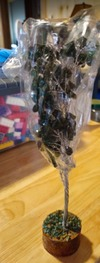

# My Mogollon's Hearth Props

*Numbering is just to identify items.*

> **This file is the master inventory.** Edit the table here on GitHub — add, change, or remove rows. New item photos go in the `props/` folder at the repo root. When you're done, say "propagate" and the workbench app and the public build page will be updated from this file.

## Soul gems & light

| # | Photo | Item | Where/how used | Notes |
|---|-------|----------------|-------|
| 1 |  | Wooden LED base, small, USB w/ switch | Lighted soul-gem stand — set a quartz point or egg on it | |
| 2 |  | Wooden LED base, large, USB w/ switch | Lighted stand for the tall tower or obsidian sphere | |
| 3 |  | Blue titanium aura quartz points (×4 at least) | Soul gems — lit from below on the wood LED bases | |
| 4 |  | Polished stone eggs — red, blue, yellow | Soul gems by size — red = greater, blue = common, yellow = lesser; bowl together | |
| 5 |  | Obsidian sphere on wood stand | Black soul gem — centerpiece of the soul-gem display | |
| 6 |  | Obsidian egg (polished black) | Second black soul gem, or a scrying stone | |
| 7 |  | Tall banded tower / obelisk | Standing-stone miniature, or altar centerpiece on the large LED base | |
| 8 |  | Crystal trees (×2, one tall w/ green stones) | Enchanted flora for altar corners | |

## The alchemy lab

| # | Photo | Item | Where/how used | Notes |
|---|-------|----------------|-------|
| 9 |  | Onyx/marble mortar and pestle | Alchemy station — centerpiece; Arcadia's Cauldron energy | |
| 10 |  | Bright yellow sulfur cluster | Fire salts / brimstone — ingredient display in a dish | |
| 11 |  | Peridot chips (bag, labeled) | Glow dust — pour into a small bowl as loose ingredients | |
| 12 |  | Yellow chips (bag — sulfur/calcite) | Salt pile / moon sugar — ingredient bowl | |
| 13 |  | Goldstone chips in tube | Gold dust — apothecary vial | |
| 14 |  | Green chips in corked vial | Potion ingredient — ready-made corked apothecary bottle | |
| 15 |  | Abalone shell | Ingredient bowl — Hagraven-made look; holds the chips | |
| 16 |  | Small banded onyx bowl | Second ingredient bowl at the alchemy station | |

## Dwemer corner

| # | Photo | Item | Where/how used | Notes |
|---|-------|----------------|-------|
| 17 |  | Bismuth cluster (rainbow geometric) | Dwemer metal — grouped on the Dwemer shelf | |
| 18 |  | Copper nugget pieces | Dwemer scrap — scatter around the bismuth as ruins debris | |
| 19 |  | Dark metallic raw mineral | Ebony ore chunk — Dwemer shelf | Photo ID tentative — confirm in hand. |

## Crypt & dungeon dressing

| # | Photo | Item | Where/how used | Notes |
|---|-------|----------------|-------|
| 20 |  | Skull-shaped planter (dark) | Draugr crypt corner — plant something spiky in it (a “deathbell”) | |
| 21 |  | Selenite bowl + carved heart stone | Heart Stone (Dragonborn) — offering bowl with the heart displayed in it | Photo ID tentative — confirm in hand. |
| 22 |  | Raw stones — brown, reddish, banded | Ore samples — iron, corundum, stone; line a shelf like a mine assay office | Photo ID tentative — confirm in hand. |
| 23 |  | Fossil / coral cross-section stone | Ancient Nord artifact — display piece | Photo ID tentative — confirm in hand. |

## Talismans & trinkets

| # | Photo | Item | Where/how used | Notes |
|---|-------|----------------|-------|
| 24 |  | Framed amber pendants / keychains (×4) | Amber (Dragonborn) — hang as talismans or gift to guests as Hearth tokens | |
| 25 |  | 2 round stones / coins in plastic | Septims — scatter in an offering bowl | Photo ID tentative — confirm in hand. |

## Suggested groupings (vignettes)

1. **Soul-gem altar** — both LED bases lit, aura points + eggs + obsidian sphere on/around them. Dark corner, maximum glow.
2. **Alchemy station** — mortar & pestle center, flanked by the abalone shell and onyx bowl full of chips, sulfur cluster in its dish, corked vial beside. This is your money shot.
3. **Dwemer shelf** — bismuth + copper + dark mineral grouped tight, like excavated ruins.
4. **Crypt corner** — skull planter with a spiky plant, selenite bowl with the heart stone.
5. **Guest tokens** — the amber pendants, one per guest room or as take-home Hearth favors.
